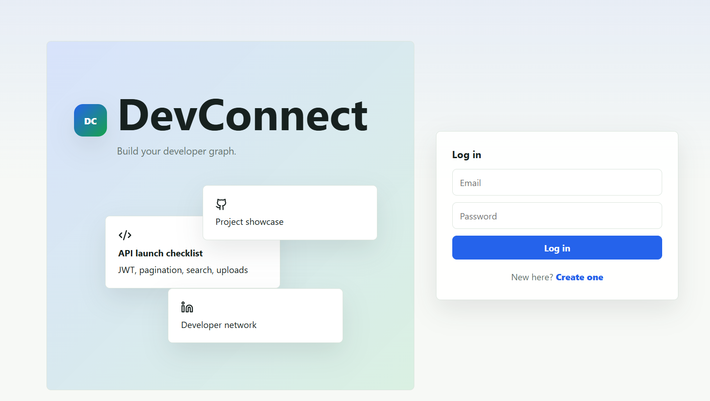
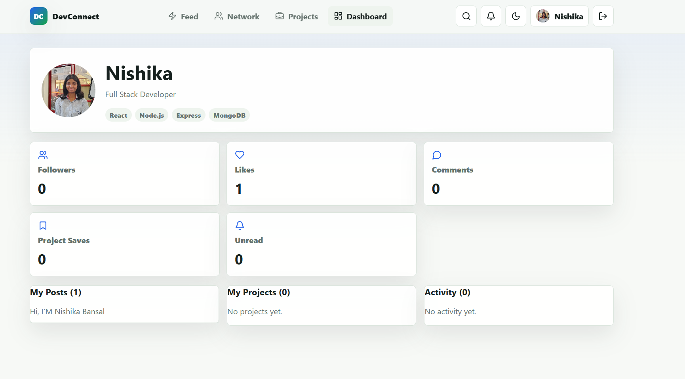
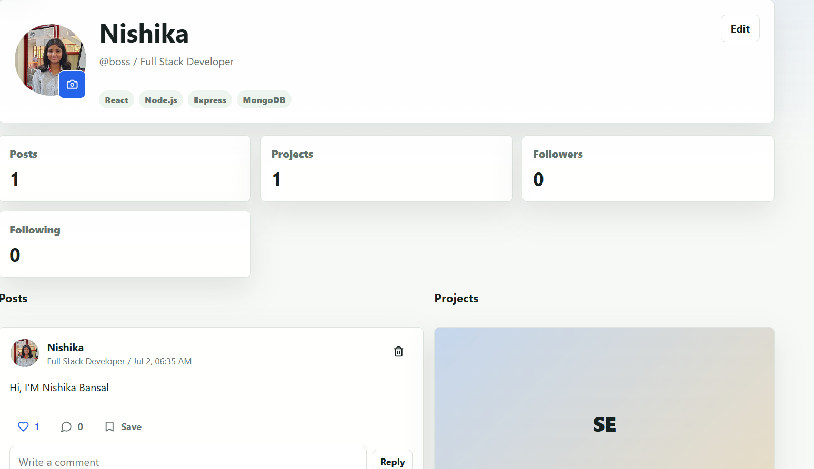
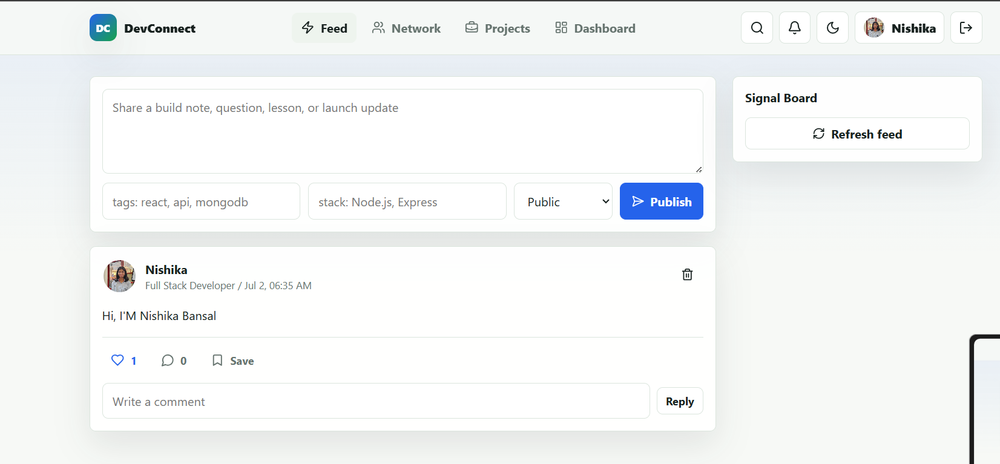

# DevConnect

DevConnect is a full-stack developer community platform inspired by LinkedIn, GitHub, and Stack Overflow. Developers can create profiles, publish posts, showcase projects, follow each other, search by skills and technologies, bookmark useful content, and receive social notifications.

## Tech Stack

- React.js with Context API, protected routes, responsive UI, dark/light theme, toasts, skeleton states, and infinite feed loading
- Node.js, Express.js, MVC structure, REST APIs, validation, centralized error handling, JWT authentication, role authorization
- MongoDB Atlas with Mongoose relationships for users, posts, projects, notifications, followers, comments, bookmarks, and saved projects
- bcrypt.js password hashing
- Cloudinary-ready image uploads for profile and project images
- Vercel-ready frontend and Render-ready backend configuration

## Features Included

- Authentication: register, login, logout, JWT auth, password hashing, protected routes, optional admin role checks
- Developer profiles: avatar, bio, headline, location, skills, technologies, experience, education, GitHub, LinkedIn, portfolio
- Community feed: create, edit, delete, like/unlike, comment, bookmark, pagination, infinite scroll
- Developer network: follow/unfollow, followers/following, suggested developers, trending developers
- Project showcase: add/edit/delete projects, tech stack, GitHub link, live demo link, optional images, save projects
- Search and filters: developers, posts, projects, skills, technologies
- Dashboard: profile overview, my posts, my projects, followers/following, activity summary
- Advanced UI: dark/light theme, loading skeletons, toast notifications, responsive layouts
- Advanced backend: notifications for follows/likes/comments/saves, upload endpoint, seed data, security middleware

## Folder Structure

```text
devconnect/
  client/       React frontend
  server/       Express API
```
---

## Screenshots

### Login


###  Dashboard


### Profile


### Feed


### Developer Network


### Projects


---


## Quick Start

1. Install dependencies:

```bash
npm install
```

2. Configure environment variables:

```bash
cp server/.env.example server/.env
cp client/.env.example client/.env
```

3. Start both apps:

```bash
npm run dev
```

The frontend runs on `http://localhost:5173` and the API runs on `http://localhost:5000`.

## Seed Demo Data

After adding `MONGO_URI` and `JWT_SECRET` in `server/.env`, seed demo users, posts, projects, and notifications:

```bash
npm run seed
```

Demo password for all seeded users:

```text
Password123!
```

## Deployment

- Frontend: deploy `client` to Vercel and set `VITE_API_URL` to your Render backend URL.
- Backend: deploy `server` to Render and set `MONGO_URI`, `JWT_SECRET`, Cloudinary keys, and `CLIENT_URL`.

## API Summary

- `/api/auth` register, login, me, logout
- `/api/users` profiles, search, follow/unfollow, followers, following, suggestions, trending
- `/api/posts` feed, CRUD, like, comment, bookmark
- `/api/projects` showcase, CRUD, save, search by technology
- `/api/dashboard` activity summary
- `/api/notifications` list, mark read, clear
- `/api/upload` Cloudinary-backed profile and project uploads

## 👩‍💻 Author

**Nishika Bansal**

- LinkedIn: https://www.linkedin.com/in/nishika-bansal-a05610290/